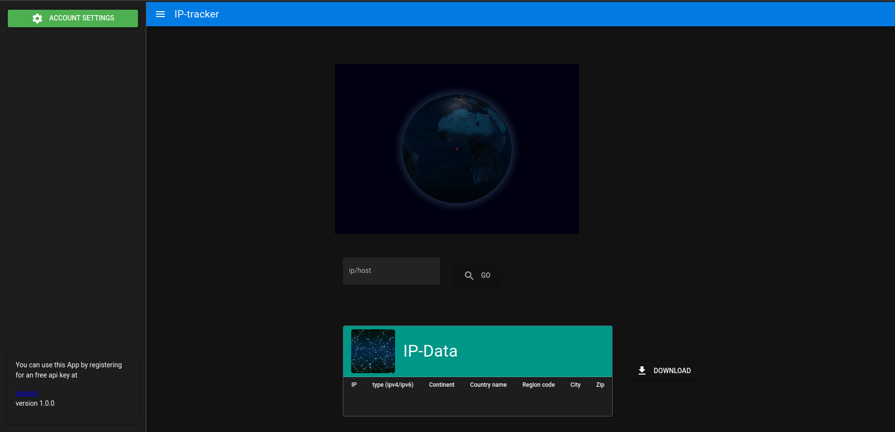

# Ip-location tracker 

A Quasar Framework app to locate any given IP/Domain.
Based on [IP Stack API](https://ipstack.com/product) and the [globe.gl Framework](https://github.com/vasturiano/globe.gl)

You can downlaod a Electron app already for Linux [here](https://github.com/KineticFox/ip-locator/releases/tag/v1.0.0)
or you can visit the ongithub hosted [page](https://kineticfox.github.io)

example:


1. get your ipsatck api key
2. enter your api-key in the account settings tab
3. search up to `10000` ips per month
4. download the found ip entries in json format if u want.


## Install the dependencies
```bash
npm install
```

### Start the app in development mode (hot-code reloading, error reporting, etc.)
```bash
quasar dev
```

### Lint the files
```bash
npm run lint
```

### Build the app for production
```bash
quasar build
quasar build -m electron
```

